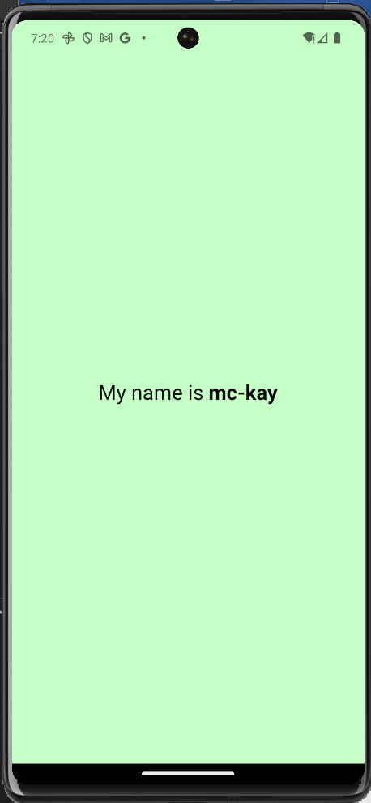
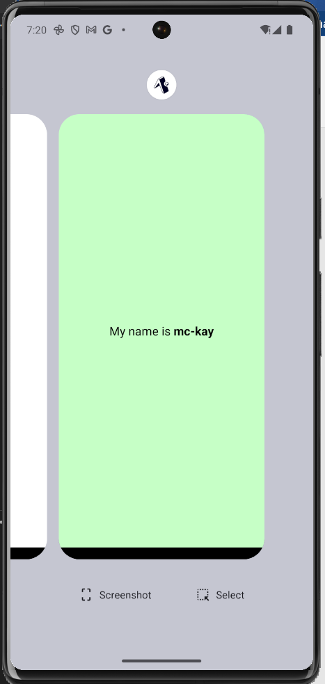

#### rn-assignment2-ID-11354613

# DCIT 202 (MOBILE APPLICATION DEVELOPMENT)

### Assignment 2

### STUDENT ID : 11354613

# Description of Task

This is the second assignment for the DCIT 202 (Mobile Application Development) course. The motive of this assignment is to buidl a simple app created with a new React Native blank template project using Expo CLI. This basic app displays the text "My name is mc-kay" with a font size of 24, in a light green color background.

# Development Tools Used for App Build.

- Expo Go, for real-time preview.
- Android Studio Emulator, for
- Expo CLI, for lanching development server.
- Visual Studio Code, for writing code managing files and folders.

## Steps I used to create a new React Native blank template project using Expo CLI.

- Run `npm install -g expo-cli`
- Run `expo init  my-new-app -- template blank`
- Run `cd my-new-app` to navigate into the project directory
- Run `npm run android` to start the development server
- Enter `a` to select `open on android`

## Features of App

- "My name is YourName" text.
- Light green background.
- Font size of 24.

## Screenshots of my-new-app app

## How to run app if cloning from this repo.

1. Clone the repository: `git clone https://github.com/McEsselB/rn-assignment2-I11354613.git`
2. Install Expo CLI: `npm install -g expo-cli`
3. Install various dependencies needed using: `npm install`
4. Start the development
   server: `expo start`
5. Open Expo Go app on your mobile device and scan the QR code displayed on the terminal OR to use an emulator, run command `a` after `expo start`, to live preview on android emulator.

### How to Setup Android Emulator Using Android Studio or VS Code

Watch👁️👁️ these two YouTube videos:

- How to setup in Android Studio

👉 https://www.youtube.com/watch?v=4rCNc3uhLJE

- How to setup emulator in vs code

👉 https://www.youtube.com/watch?v=as_HHSFT304

###### You can follow me on github 😉 @ https://github.com/McEsselB
